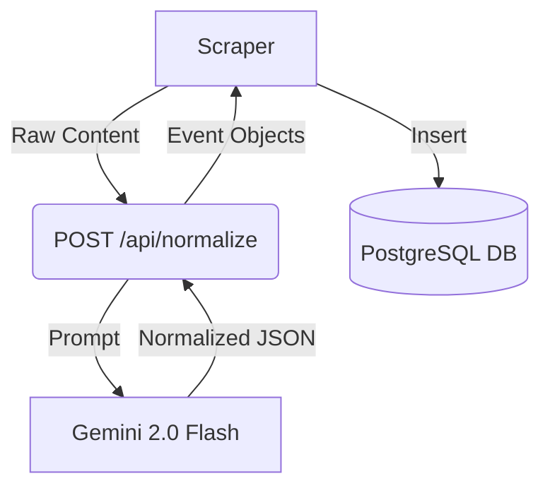
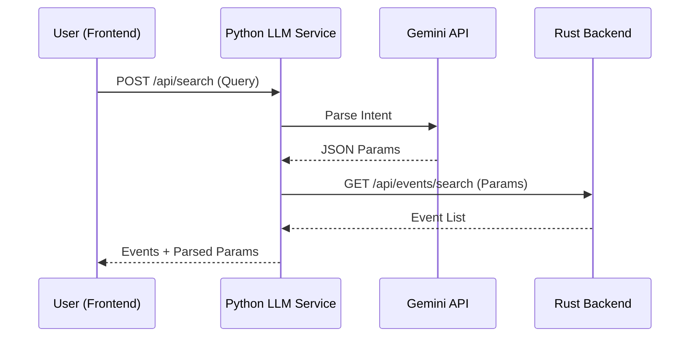

# Locate918: AI & LLM Service Strategy

**Author:** Ben Halcomb (AI Engineer)  
**Service:** `llm-service` (Python/FastAPI)  
**Model Provider:** Google Gemini API (Gemini 2.0 Flash)

---

## 1. Service Overview

The **Locate918 AI Service** is a standalone Python application responsible for all non-deterministic logic within the platform. It acts as an intelligence layer between the raw data collected by scrapers and the user-facing application.

### Core Goals
1.  **Normalization:** Convert messy, unstructured scraper data into strict database schemas.
2.  **Smart Search:** Parse natural language queries into structured parameters and retrieve results.
3.  **Conversational Agent (Tully):** Provide a helpful, context-aware chat interface that can search the database.

---

## 2. Core Responsibilities

The service manages three distinct pipelines:

### A. Event Normalization (The "Cleaner")
* **Input:** Raw HTML or JSON from scrapers.
* **Process:** Uses Gemini 2.0 Flash to extract structured entities (Date, Time, Location, Price, Category) and standardize formatting into `NormalizedEvent` objects.
* **Output:** Strict JSON matching the `events` table schema.
* **Why:** Scrapers are brittle; the LLM handles inconsistent HTML structures and varying date formats gracefully.

### B. Smart Search (The "Translator")
* **Endpoint:** `POST /api/search`
* **Input:** Natural language query (e.g., "jazz concerts this weekend under $30").
* **Process:**
    1.  Uses Gemini to parse the query into structured parameters (`category`, `price_max`, `start_date`, etc.).
    2.  Queries the Rust Backend (`/api/events/search`) with these parameters.
* **Output:** A response containing both the parsed parameters and the list of matching events.

### C. Conversational Agent (The "Concierge" - Tully)
* **Endpoint:** `POST /api/chat`
* **Input:** User message, user ID, and conversation history.
* **Process:**
    1.  Maintains conversation history.
    2.  Uses **Gemini Function Calling**. If the user asks for events, the model generates a tool call (`search_events`).
    3.  The service executes this tool against the Rust Backend.
    4.  The results are fed back to the model to generate a natural language response.
* **Output:** A friendly, text-based response (no Markdown, simple formatting).

---

## 3. Data Flow Architecture

### Workflow 1: Data Ingestion (Write Path)
*Runs in background via scrapers.*



### Workflow 2: Smart Search (Read Path)
*Fast, single-turn query.*



---

## 4. API Contract & Schemas

### Endpoint: `/api/normalize`

**Usage:** Called by scrapers to clean data.

* **Request Body:**
```json
{
  "raw_content": "string",
  "source_url": "string",
  "content_type": "html"
}

```


* **Response Model (Target Schema):**
```json
{
  "title": "string",
  "venue": "string",
  "venue_address": "string",
  "start_time": "2026-02-09T20:50:27.364Z",
  "end_time": "2026-02-09T20:50:27.364Z",
  "description": "string",
  "categories": [
    "string"
  ],
  "price_min": 0,
  "price_max": 0,
  "outdoor": true,
  "family_friendly": true,
  "image_url": "string"
}

```


### Endpoint: `/api/parse-intent`

**Usage:** Called by backend to convert chat to SQL params.

* **Request Body:**
```json
{
  "user_message": "Any food festivals this Saturday?",
  "current_time": "2026-01-18T14:30:00"
}

```


* **Response Model:**
```json
{
  "search_query": "food festival",
  "categories": ["food", "dining", "festival"],
  "date_range": {
    "start": "2026-01-24T00:00:00",
    "end": "2026-01-24T23:59:59"
  },
  "location_filter": null
}

```


---

## 5. Machine Learning & Future Enhancements

While the MVP relies on Gemini for zero-shot inference, the following ML components should also be implemented:

1. **Vector Embeddings (Semantic Search)**
* **Goal:** Allow "spooky vibes" to match "Haunted House" without keyword overlap.
* **Tech:** Use `sentence-transformers` (e.g., `all-MiniLM-L6-v2`) or Gemini Embeddings to generate vector representations of event descriptions.
* **Storage:** Store vectors in PostgreSQL using `pgvector`.


2. **User Preference Modeling**
* **Goal:** Personalize ranking based on history.
* **Tech:** Simple weighted vector of user's past interacted categories (e.g., `User_A = [Jazz: 0.8, Sports: 0.1]`).


3. **Feedback Loop**
* **Goal:** Improve scraper accuracy.
* **Tech:** Log low-confidence normalizations (< 0.7 score) for manual review to fine-tune future prompts.


---

## 6. Implementation Checklist (Ben)

### Phase 1: Setup

* [ ] Initialize FastAPI project structure (`llm-service/`).
* [ ] Set up virtual environment and install `fastapi`, `uvicorn`, `google-generativeai`, `pydantic`, `python-dotenv`.
* [ ] Implement `GeminiClient` class for API key management.

### Phase 2: Normalization (The Scraper Helper)

* [ ] Define `EventSchema` Pydantic model.
* [ ] Create the prompt template for extracting event data from raw text.
* [ ] Implement `POST /api/normalize` endpoint.
* [ ] Test with sample raw text from Eventbrite.

### Phase 3: Intent Parsing (The Search Brain)

* [ ] Define `SearchIntent` Pydantic model.
* [ ] Create prompt template for date/category extraction (ensure it handles relative dates like "next friday").
* [ ] Implement `POST /api/parse-intent` endpoint.

### Phase 4: Chat (The UI)

* [ ] Implement `POST /api/chat` that accepts a JSON list of events + user query.
* [ ] specific system prompt to prevent hallucinations (strict "answer only based on provided context" rule).

### Phase 5: Integration

* [ ] Coordinate with Will (Backend) to test JSON field alignment.
* [ ] Coordinate with Skylar (Data) to test scraper inputs.

---

### (Important)

**This is just the first iteration of the AI/LLM documentation, and it will in all likelyhood change as we continue to work through the project.**
## 6. Current Implementation Status
### Implemented Features 
*   Gemini Integration: Successfully using gemini-2.0-flash via google-genai SDK. 
* *   Normalization: normalize_events function handles HTML/JSON parsing. 
* *   Intent Parsing: parse_user_intent extracts search parameters. 
* *   Chat Logic: generate_chat_response handles system prompts, history management, and tool execution loop. 
* *   Tooling: search_events tool is defined and connected to the backend. 
* ### Configuration 
* *   System Prompts: Tuned to enforce Tulsa-specific context, date inference, and plain text formatting. 
* *   Tools: Currently supports search_events. Google Search grounding was attempted but disabled due to conflict with Function Calling in the current API version.