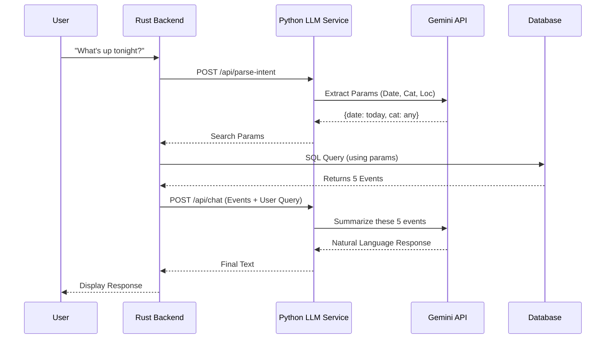

# Locate918: AI & LLM Service Strategy

**Author:** Ben Halcomb (AI Engineer)  
**Service:** `llm-service` (Python/FastAPI)  
**Model Provider:** Google Gemini API  

---

## 1. Service Overview

The **Locate918 AI Service** is a standalone Python application responsible for all non-deterministic logic within the platform. It acts as an intelligence layer between the raw data collected by scrapers and the user-facing application, ensuring that event data is clean and that user interactions are natural.

### Core Goals
1.  **Normalization:** Convert messy, unstructured scraper data into strict database schemas.
2.  **Intent Extraction:** Translate natural language chat inputs into SQL-compatible search parameters.
3.  **Summarization:** Provide friendly, conversational context for event results.

---

## 2. Core Responsibilities

The service manages three distinct pipelines:

### A. Event Normalization (The "Cleaner")
* **Input:** Raw text or HTML snippets from scrapers (Eventbrite, local calendars, Facebook events).
* **Process:** Uses Gemini to extract structured entities (Date, Time, Location, Price, Category) and standardize formatting.
* **Output:** Strict JSON matching the `events` table schema in the database.
* **Why:** Scrapers are brittle; the LLM handles inconsistent HTML structures, missing tags, and varying date formats gracefully.

### B. Intent Parsing (The "Translator")
* **Input:** Natural language user queries (e.g., *"Find me something kid-friendly downtown this weekend"*).
* **Process:**
    1.  Analyzes the string for **temporal entities** ("this weekend" → calculated `start_date` / `end_date`).
    2.  Extracts **categorical intents** ("kid-friendly" → `tags: ['family', 'children']`).
    3.  Identifies **geolocation context** ("downtown" → `zone_id` or lat/long radius).
* **Output:** Structured search parameters for the Rust backend's SQL query.

### C. Conversational Agent (The "Concierge")
* **Input:** A list of retrieved events (from the Rust backend) + the user's original message.
* **Process:** Generates a friendly, summarized response. It does *not* hallucinate events; it only summarizes the JSON context provided to it.
* **Output:** Natural language text response.

---

## 3. Data Flow Architecture

### Workflow 1: Data Ingestion (Write Path)
*This pipeline runs in the background when scrapers find new data.*

````mermaid
graph TD
    A["Scraper (Rust/Python)"] -->|Raw HTML/Text| B("POST /api/normalize")
    B -->|Prompt + Context| C["Gemini API"]
    C -->|Structured JSON| B
    B -->|Event Object| A
    A -->|Insert| D[("PostgreSQL DB")]
````

### Workflow 2: User Search (Read Path)

*This pipeline runs in real-time when a user messages the chatbot.*



---

## 4. API Contract & Schemas

### Endpoint: `/api/normalize`

**Usage:** Called by scrapers to clean data.

* **Request Body:**
```json
{
  "raw_text": "Live Jazz at The Colony! Doors 7pm, $10 cover. 21+ only.",
  "source_url": "[https://example.com/events/123](https://example.com/events/123)",
  "scraper_source": "venue_website"
}

```


* **Response Model (Target Schema):**
```json
{
  "title": "Live Jazz",
  "venue": "The Colony",
  "start_time": "2026-01-18T19:00:00",
  "end_time": null,
  "price_min": 10.00,
  "price_max": 10.00,
  "age_restriction": "21+",
  "tags": ["music", "jazz", "nightlife"],
  "confidence_score": 0.95
}

```


### Endpoint: `/api/parse-intent`

**Usage:** Called by backend to convert chat to SQL params.

* **Request Body:**
```json
{
  "user_message": "Any food festivals this Saturday?",
  "current_time": "2026-01-18T14:30:00"
}

```


* **Response Model:**
```json
{
  "search_query": "food festival",
  "categories": ["food", "dining", "festival"],
  "date_range": {
    "start": "2026-01-24T00:00:00",
    "end": "2026-01-24T23:59:59"
  },
  "location_filter": null
}

```


---

## 5. Machine Learning & Future Enhancements

While the MVP relies on Gemini for zero-shot inference, the following ML components should also be implemented:

1. **Vector Embeddings (Semantic Search)**
* **Goal:** Allow "spooky vibes" to match "Haunted House" without keyword overlap.
* **Tech:** Use `sentence-transformers` (e.g., `all-MiniLM-L6-v2`) or Gemini Embeddings to generate vector representations of event descriptions.
* **Storage:** Store vectors in PostgreSQL using `pgvector`.


2. **User Preference Modeling**
* **Goal:** Personalize ranking based on history.
* **Tech:** Simple weighted vector of user's past interacted categories (e.g., `User_A = [Jazz: 0.8, Sports: 0.1]`).


3. **Feedback Loop**
* **Goal:** Improve scraper accuracy.
* **Tech:** Log low-confidence normalizations (< 0.7 score) for manual review to fine-tune future prompts.


---

## 6. Implementation Checklist (Ben)

### Phase 1: Setup

* [ ] Initialize FastAPI project structure (`llm-service/`).
* [ ] Set up virtual environment and install `fastapi`, `uvicorn`, `google-generativeai`, `pydantic`, `python-dotenv`.
* [ ] Implement `GeminiClient` class for API key management.

### Phase 2: Normalization (The Scraper Helper)

* [ ] Define `EventSchema` Pydantic model.
* [ ] Create the prompt template for extracting event data from raw text.
* [ ] Implement `POST /api/normalize` endpoint.
* [ ] Test with sample raw text from Eventbrite.

### Phase 3: Intent Parsing (The Search Brain)

* [ ] Define `SearchIntent` Pydantic model.
* [ ] Create prompt template for date/category extraction (ensure it handles relative dates like "next friday").
* [ ] Implement `POST /api/parse-intent` endpoint.

### Phase 4: Chat (The UI)

* [ ] Implement `POST /api/chat` that accepts a JSON list of events + user query.
* [ ] specific system prompt to prevent hallucinations (strict "answer only based on provided context" rule).

### Phase 5: Integration

* [ ] Coordinate with Will (Backend) to test JSON field alignment.
* [ ] Coordinate with Skylar (Data) to test scraper inputs.

---

### (Important)

**This is just the first iteration of the AI/LLM documentation and it will in all likelyhood change as we continue to work through the project.**
