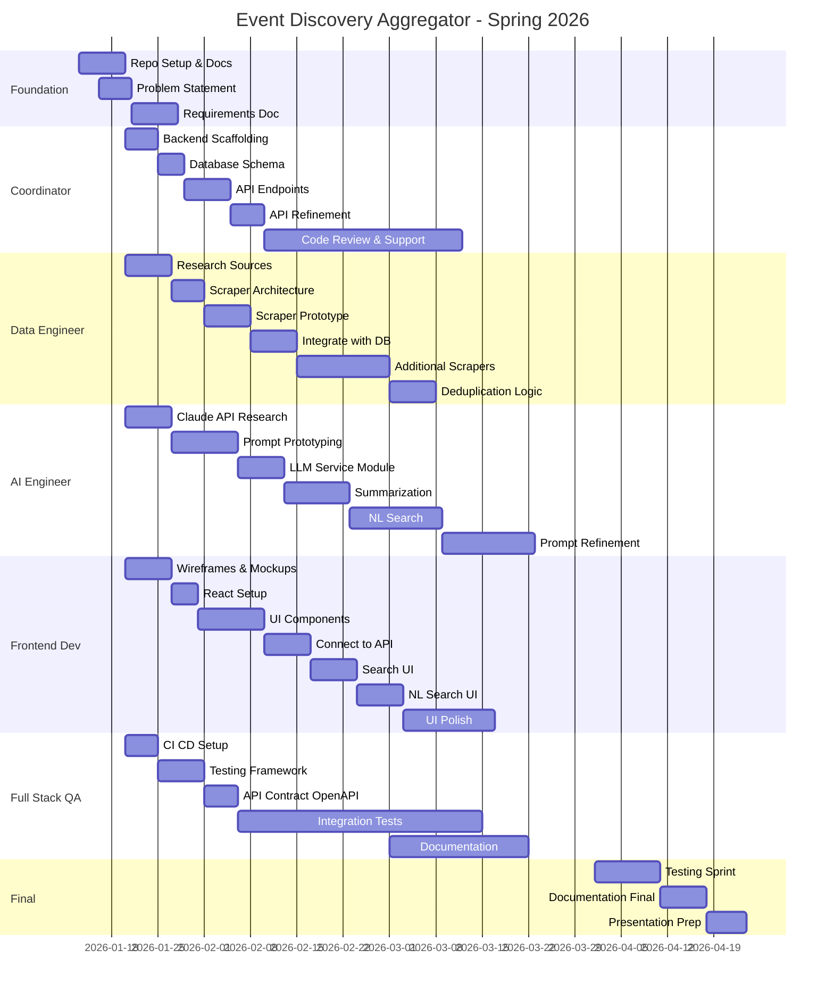

# Project Timeline

## Gantt Chart (Parallel Workflow)

## Parallel Work Summary

| Week | Coordinator - Will | Data Engineer - Skylar | AI/LLM Engineer - Ben | Frontend Dev - Malachi | Full Stack/QA - Jordi |
|------|-------------|---------------|-----------------|--------------|---------------|
| 1-2 | Docs + Start backend | Docs + Research sources | Docs + Claude research | Docs + Wireframes | Docs + CI/CD |
| 3-4 | DB schema + API endpoints | Scraper architecture + prototype | Prompt prototyping | React setup + mock UI | Testing framework + OpenAPI spec |
| 5-6 | API refinement | Integrate scrapers with DB | LLM service module | Connect UI to API | Integration tests |
| 7-8 | Support + review | Additional scrapers | Summarization | Search UI | Documentation |
| 9-10 | Support + review | Deduplication | NL search | NL search UI | Bug fixes |
| 11-12 | Support + review | Polish | Prompt refinement | UI polish | Documentation |
| 13-14 | Presentation | Presentation | Presentation | Presentation | Presentation |

## Milestone Checkpoints

| Date | Milestone | Who Presents |
|------|-----------|--------------|
| Jan 23 | Problem Statement & Timeline | Coordinator |
| Feb 7 | System Requirements Spec | All |
| Feb 14 | Backend API Demo | Coordinator |
| Feb 21 | Scraper Demo | Data Engineer |
| Mar 1 | Architecture Design Doc | All |
| Mar 7 | Frontend Demo | Frontend Dev |
| Mar 15 | Midcourse Presentation | All |
| Mar 21 | LLM Integration Demo | AI Engineer |
| Apr 10 | Feature Complete | All |
| Apr 24 | Final Presentation | All |

## Risk Mitigation

| Risk | Mitigation | Owner |
|------|------------|-------|
| Backend delays block everyone | OpenAPI spec + mock data enables parallel work | Full Stack |
| Scraper sources change or break | Build 3-5 scrapers, only need 2 working | Data Engineer |
| LLM responses unpredictable | Start prompt engineering early, iterate | AI Engineer |
| Integration issues | Weekly integration checkpoints | Full Stack |
| Scope creep | MVP first, stretch goals documented separately | Coordinator |
