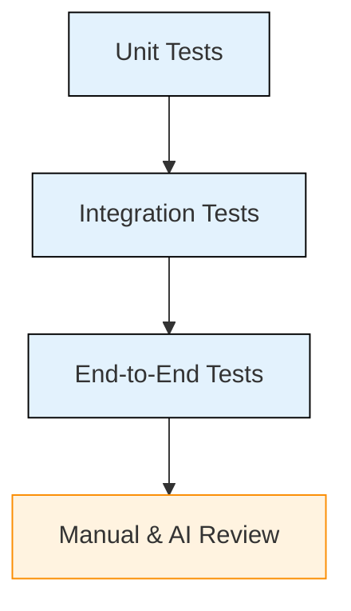
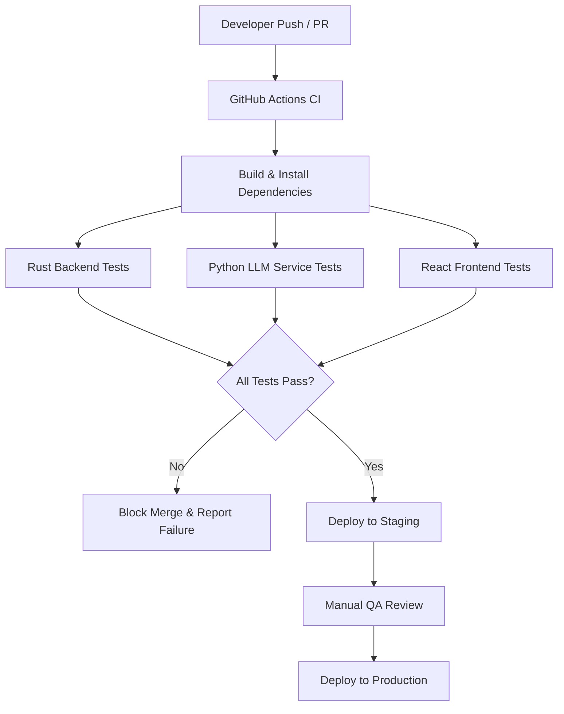

# QA & CI/CD Strategy

**Author:** Jordi Jerez (Fullstack Developer)

---

## 1. Purpose & Scope

This document defines the Quality Assurance (QA) and Continuous Integration / Continuous Deployment (CI/CD) strategy for the **Locate918** project.

The goal of this strategy is to ensure system reliability, data correctness, AI output consistency, and a high-quality user experience across all components of the platform, including the backend services, AI processing pipeline, and frontend application.

## 2. System Overview

Locate918 is an AI-powered event aggregation platform that collects event data from multiple public sources, normalizes and summarizes the data using a Large Language Model (Google Gemini), and presents personalized event recommendations through a natural language interface.

The system consists of:
- A Rust-based backend API
- A Python-based LLM service
- A React frontend application

## 3. Quality Assurance Strategy

### 3.1 Testing Levels

#### Unit Testing

Unit tests validate individual components and functions in isolation.

- Backend (Rust): API handlers, business logic, event filtering, and data validation
- LLM Service (Python): prompt handling, schema validation, and normalization logic
- Frontend (React): component rendering and user input processing

Unit tests are executed automatically as part of the CI pipeline.

#### Integration Testing

Integration tests verify interactions between system components, including:
- Backend API and PostgreSQL database
- Backend API and LLM service
- Frontend application and backend API

These tests ensure data flows correctly across service boundaries.

#### End-to-End Testing

End-to-end tests simulate real user workflows, including:
- Submitting natural language queries
- Retrieving and displaying event results
- Accessing original event source links

These tests validate that the complete system functions as expected from a user perspective.

### 3.2 AI-Specific QA Controls

Due to the use of an LLM for event normalization and summarization, additional QA measures are applied:

- Output schema validation to prevent malformed data
- Required field enforcement for critical event attributes
- Prompt versioning to track AI behavior changes
- Regression testing on prompt updates
- Manual review of AI-generated summaries for quality assurance

### 3.3 Bug Tracking & Defect Management

All defects are tracked using GitHub Issues.

Each bug report includes:
- Description of the issue
- Steps to reproduce
- Expected vs. actual behavior
- Severity level
- Relevant logs or AI output samples

### 3.4 Definition of Done

A feature is considered complete only when:
- Code implementation is finalized
- All automated tests pass
- AI output validation succeeds
- No unresolved high-severity defects exist
- Code review is completed
- CI pipeline passes successfully

## 4. CI/CD Strategy

### 4.1 Continuous Integration

Continuous Integration is implemented using GitHub Actions.

CI pipelines are triggered on:
- Pull requests
- Pushes to the main and develop branches

The pipeline performs:
- Dependency installation
- Build validation
- Automated testing
- Static analysis

### 4.2 Continuous Delivery / Deployment

The project uses a staged deployment approach:
- Automatic deployment to a staging environment
- Manual approval required for production deployment

This approach reduces risk and allows validation of AI-driven features before public release.

### 4.3 Branching Strategy

The project follows a structured branching model:
- main: stable production-ready code
- develop: integration branch
- feature/*: individual feature development

All changes require successful CI checks and code review prior to merging.

## 5. Roles & Responsibilities

- Full Stack / QA Lead: Defines QA standards, maintains CI/CD pipelines, and oversees quality validation
- Developers: Implement features, write tests, and fix defects
- Team Members: Participate in code reviews and adhere to quality standards

---

## Notes and Considerations
- This QA and CI/CD strategy reflects intentional trade-offs.
- Event data accuracy is not guaranteed, users are redircted to original sources for verification.
- Future improvements may expand test coverage, AI confidence metrics, and increased depolyment automation.
